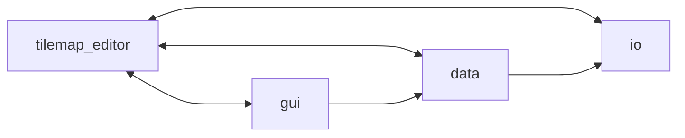
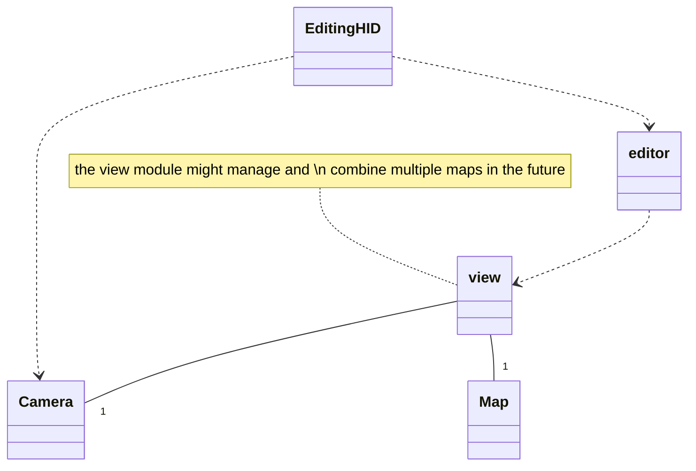
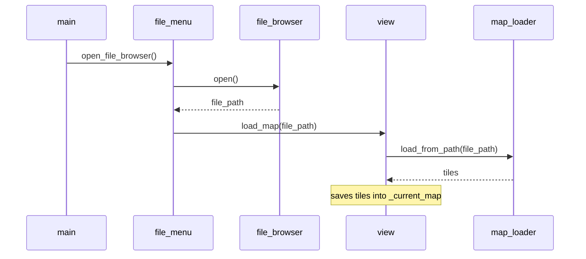
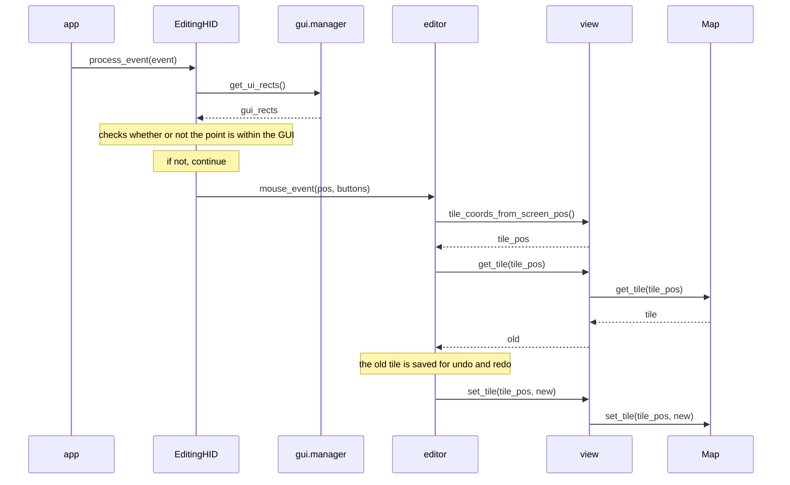

# Description of the architecture

## File & package structure

* The top-level `tilemap_editor` package contains modules that manage the whole program, such as `app.py`, and modules that are extensively used in inter-package communication, such as `camera.py`.
* The `data` package contains modules that deal with rendering, storing and modifying the tilemaps: the central pieces of the whole program, so to say.
* The `io` ("Input/Output") package contains modules that deal with either interacting with the file system or with the human input coming into the system via, for example, keyboard and mouse.
* The `gui` ("Graphical User Interface") package contains modules that handle the rest of the user interaction outside moving around and editing the tilemap.

## Module & class interaction

_Above a simplified representation of the core module interaction._

- The `EditingHID` (singleton) class manages the commands related to moving around and editing the map via the user's keyboard & mouse and relies this information forward (mainly to the `Camera` (singleton) class and the `editor` module).
- The `editor` module manages and stores the individual changes (and undos + redos) made by the user to the tilemap and relies those to the `view` module.
- The `view` module manages and saves the `Map`(s) that the user sees: the user's "view", so to speak. Drawing is done based on the information (position in the world) from the `Camera` singleton.

## Example sequence diagram of module interaction

The following sequence diagram showcases the module interaction whenever the user presses the button for loading a map file.

And the following sequence diagram shows what happens whenever the user clicks on a position on the screen:

