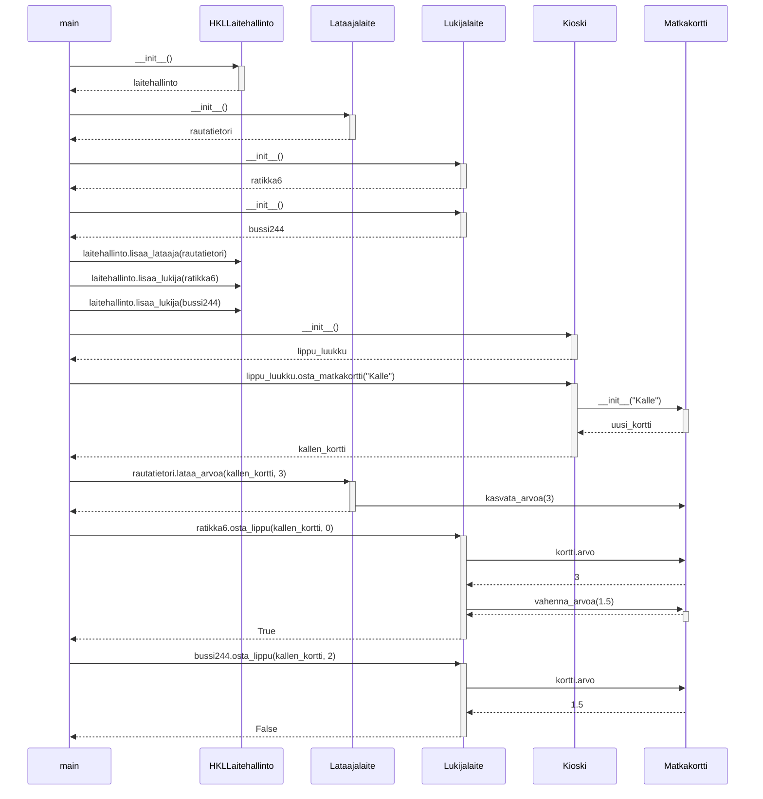

```mermaid
sequenceDiagram
    main ->>+ HKLLaitehallinto: __init__()
    HKLLaitehallinto -->>- main: laitehallinto
    main ->>+ Lataajalaite: __init__()
    Lataajalaite -->>- main: rautatietori
    main ->>+ Lukijalaite: __init__()
    Lukijalaite -->>- main: ratikka6
    main ->>+ Lukijalaite: __init__()
    Lukijalaite -->>- main: bussi244

    main ->> HKLLaitehallinto: laitehallinto.lisaa_lataaja(rautatietori)
    main ->> HKLLaitehallinto: laitehallinto.lisaa_lukija(ratikka6)
    main ->> HKLLaitehallinto: laitehallinto.lisaa_lukija(bussi244)

    main ->>+ Kioski: __init__()
    Kioski -->>- main: lippu_luukku
    main ->>+ Kioski: lippu_luukku.osta_matkakortti("Kalle")
    Kioski ->>+ Matkakortti: __init__("Kalle")
    Matkakortti -->>- Kioski: uusi_kortti
    Kioski -->>- main: kallen_kortti

    main ->>+ Lataajalaite: rautatietori.lataa_arvoa(kallen_kortti, 3)
    Lataajalaite ->> Matkakortti: kasvata_arvoa(3)
    Lataajalaite -->>- main:

    main ->>+ Lukijalaite: ratikka6.osta_lippu(kallen_kortti, 0)
    Lukijalaite ->> Matkakortti: kortti.arvo
    Matkakortti -->> Lukijalaite: 3
    Lukijalaite ->>+ Matkakortti: vahenna_arvoa(1.5)
    Matkakortti -->>- Lukijalaite:
    Lukijalaite -->>- main: True

    main ->>+ Lukijalaite: bussi244.osta_lippu(kallen_kortti, 2)
    Lukijalaite ->> Matkakortti: kortti.arvo
    Matkakortti -->> Lukijalaite: 1.5
    Lukijalaite -->>- main: False
```
