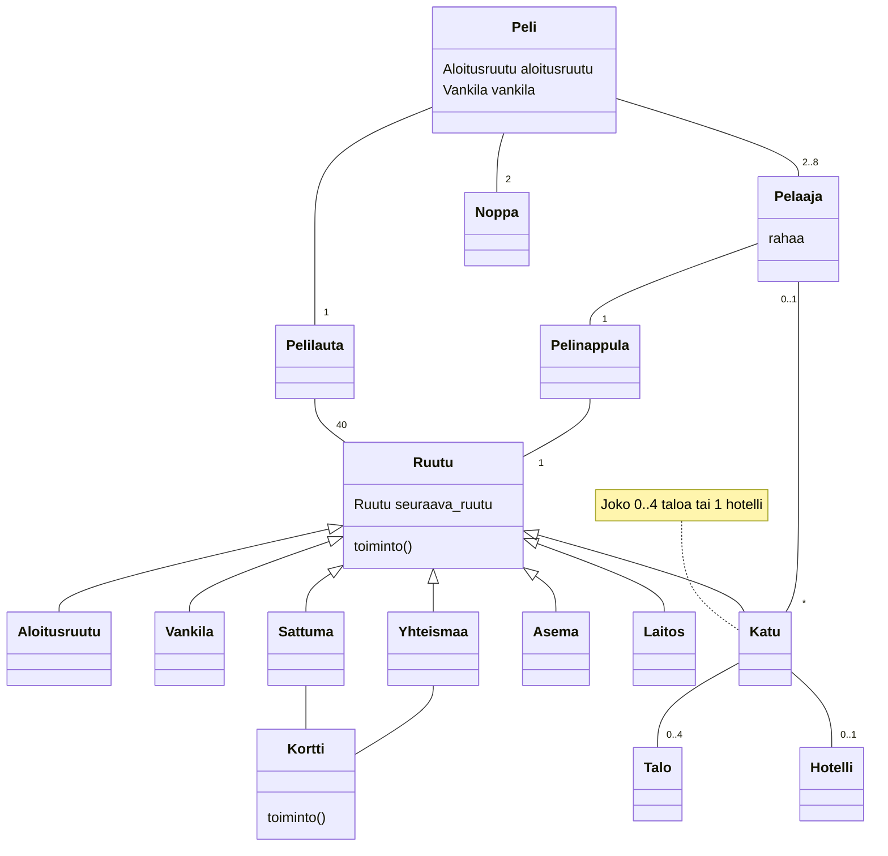

```mermaid
classDiagram
    class Peli {
        Aloitusruutu aloitusruutu
        Vankila vankila
    }
        class Ruutu {
        Ruutu seuraava_ruutu
        toiminto()
    }
    class Pelaaja {
        rahaa
    }
    Peli -- "2..8" Pelaaja
    Peli -- "2" Noppa
    Peli -- "1" Pelilauta
    Pelilauta -- "40" Ruutu

    Pelaaja -- "1" Pelinappula
    Pelinappula -- "1" Ruutu

    Ruutu <|-- Aloitusruutu
    Ruutu <|-- Vankila
    Ruutu <|-- Sattuma
    Ruutu <|-- Yhteismaa
    Ruutu <|-- Asema
    Ruutu <|-- Laitos
    Ruutu <|-- Katu

    class Kortti {
        toiminto()
    }
    Sattuma -- Kortti
    Yhteismaa -- Kortti

    Katu -- "0..4" Talo
    Katu -- "0..1" Hotelli
    note for Katu "Joko 0..4 taloa tai 1 hotelli"
    Katu "*" -- "0..1" Pelaaja
```
