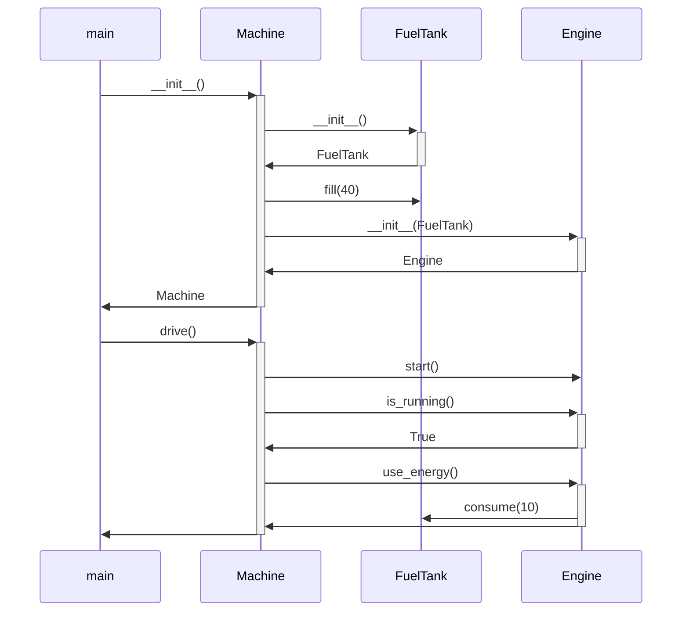

```mermaid
sequenceDiagram
    main ->>+ Machine : __init__()
    Machine ->>+ FuelTank: __init__()
    FuelTank ->>- Machine: FuelTank
    Machine ->> FuelTank: fill(40)
    Machine ->>+ Engine: __init__(FuelTank)
    Engine ->>- Machine: Engine
    Machine ->>- main: Machine

    main ->>+ Machine: drive()
    Machine ->> Engine: start()
    Machine ->>+ Engine: is_running()
    Engine ->>- Machine: True
    Machine ->>+ Engine: use_energy()
    Engine ->> FuelTank: consume(10)
    Engine ->>- Machine:
    Machine ->>- main:
```
